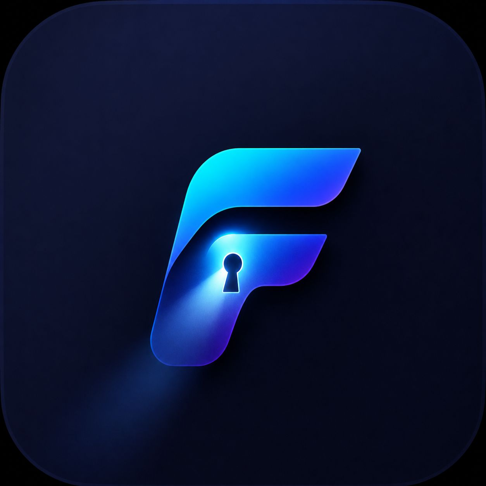

  

<h1 align="center">FaultPass</h1>

  <strong>Secure. Fast. Global.</strong>

  International VPN service built for a secure, fast and reliable internet experience.

  
  
  

  <a href="#english">English</a> •
  <a href="#فارسی">فارسی</a> •
  <a href="#русский">Русский</a> •
  <a href="#中文">中文</a>

---

<h2 align="center">⬇️ Download FaultPass</h2>

  <a href="https://github.com/FaultPass/FaultPass/releases/download/v4.2.0/FaultPass.apk">
    📱 <strong>Android</strong>
  </a>
  &nbsp;&nbsp;&nbsp;&nbsp;
  <a href="https://github.com/USERNAME/REPOSITORY/releases/latest/download/FaultPass-Windows.exe">
    💻 <strong>Windows</strong>
  </a>

---

## 🇬🇧 English

### About

**FaultPass** is an international VPN service designed to provide a secure, fast and reliable connection to the internet.

Built with simplicity and performance in mind, FaultPass delivers a modern connection experience without unnecessary complexity.

### Key Features

- 🌍 International connectivity
- ⚡ Fast and reliable connections
- 🔒 Secure and private communication
- 🎯 Clean and intuitive user experience
- 🚀 Continuous performance improvements

### Downloads

**Android**  
[Download the latest version →](https://github.com/FaultPass/FaultPass/releases/download/v4.2.0/FaultPass.apk)

**Windows**  
[Download the latest version →](https://github.com/USERNAME/REPOSITORY/releases/latest/download/FaultPass-Windows.exe)

### Software License

FaultPass is **proprietary software** and is **not open source**.

This repository is the official GitHub repository of FaultPass and is used exclusively for official releases and project information.

---

## 🇮🇷 فارسی

### درباره FaultPass

**FaultPass** یک سرویس VPN بین‌المللی است که با هدف ارائه تجربه‌ای **امن، سریع و پایدار** از اتصال به اینترنت طراحی شده است.

FaultPass با تمرکز بر **سادگی، عملکرد و تجربه کاربری مدرن**، تلاش می‌کند اتصال قابل‌اعتماد به اینترنت را بدون پیچیدگی‌های غیرضروری در اختیار کاربران قرار دهد.

### ویژگی‌ها

- 🌍 اتصال بین‌المللی
- ⚡ اتصال سریع و پایدار
- 🔒 ارتباط امن و خصوصی
- 🎯 رابط کاربری ساده و مدرن
- 🚀 بهبود مستمر عملکرد و کیفیت سرویس

### دانلود

**اندروید**  
[دانلود آخرین نسخه ←](https://github.com/FaultPass/FaultPass/releases/download/v4.2.0/FaultPass.apk)

**ویندوز**  
[دانلود آخرین نسخه ←](https://github.com/USERNAME/REPOSITORY/releases/latest/download/FaultPass-Windows.exe)

### وضعیت نرم‌افزار

FaultPass یک نرم‌افزار **اختصاصی (Proprietary)** و **غیرمتن‌باز** است.

این مخزن، صفحه رسمی FaultPass در GitHub است و صرفاً برای انتشار نسخه‌های رسمی و ارائه اطلاعات مربوط به پروژه استفاده می‌شود.

---

## 🇷🇺 Русский

### О FaultPass

**FaultPass** — международный VPN-сервис, разработанный для обеспечения **безопасного, быстрого и стабильного** подключения к интернету.

FaultPass сочетает **простоту, производительность и современный пользовательский интерфейс**, обеспечивая удобный и надежный опыт подключения.

### Возможности

- 🌍 Международное подключение
- ⚡ Быстрое и стабильное соединение
- 🔒 Безопасность и конфиденциальность
- 🎯 Простой и современный интерфейс
- 🚀 Постоянное улучшение производительности

### Скачать

**Android**  
[Скачать последнюю версию →](https://github.com/FaultPass/FaultPass/releases/download/v4.2.0/FaultPass.apk)

**Windows**  
[Скачать последнюю версию →](https://github.com/USERNAME/REPOSITORY/releases/latest/download/FaultPass-Windows.exe)

### О программном обеспечении

FaultPass является **проприетарным программным обеспечением** и **не является проектом с открытым исходным кодом**.

Этот репозиторий является официальной страницей FaultPass на GitHub и предназначен исключительно для публикации официальных версий и информации о проекте.

---

## 🇨🇳 中文

### 关于 FaultPass

**FaultPass** 是一款国际 VPN 服务，旨在提供**安全、快速且稳定**的互联网连接体验。

FaultPass 专注于**简洁性、性能和现代化用户体验**，让用户能够更加轻松地享受稳定可靠的网络连接。

### 主要功能

- 🌍 国际网络连接
- ⚡ 快速稳定的连接
- 🔒 安全与隐私保护
- 🎯 简洁现代的用户界面
- 🚀 持续优化服务性能

### 下载

**Android**  
[下载最新版本 →](https://github.com/FaultPass/FaultPass/releases/download/v4.2.0/FaultPass.apk)

**Windows**  
[下载最新版本 →](https://github.com/USERNAME/REPOSITORY/releases/latest/download/FaultPass-Windows.exe)

### 软件说明

FaultPass 是**专有软件**，**不是开源项目**。

此仓库是 FaultPass 的官方 GitHub 页面，仅用于发布官方版本及提供项目相关信息。

---

  <strong>FaultPass</strong> 
  Secure. Fast. Global.

